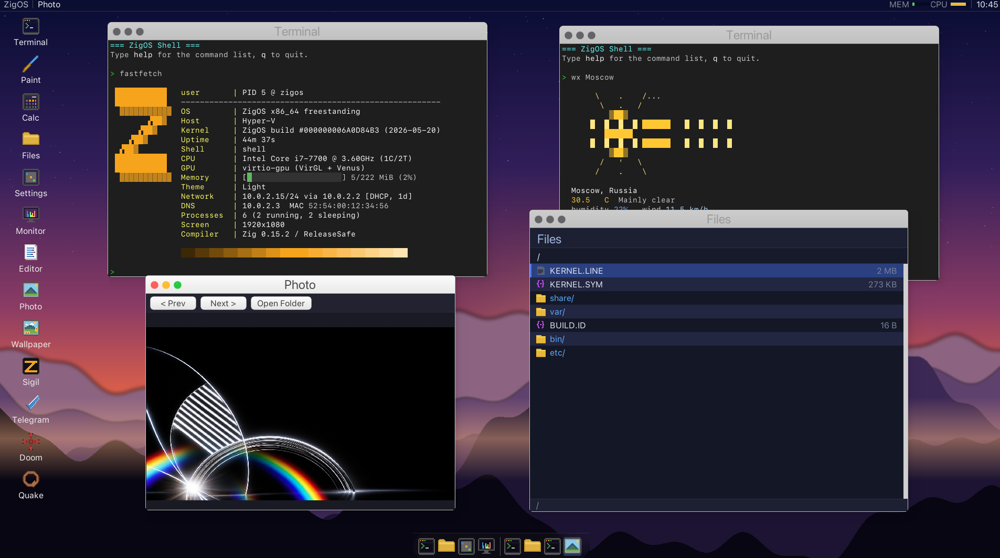

# ZigOS



x86_64 hobby OS in Zig (~106 KLoC) — SMP + hybrid-CFS scheduler, IOMMU
isolation, NVMe with async Q_DEPTH=16, Vulkan compositor via virtio-gpu +
Venus, TLS 1.3 with Mozilla NSS roots, 68 userspace apps including Doom
and Quake 1.

The screenshot above is a real boot: a shell with `fastfetch`, `wx Moscow`
(HTTPS + JSON over the kernel's TLS stack), the photo viewer (`stb_image`
PNG decode), and the file manager — all userspace ELFs on top of a fresh
kernel.

## Running it

**This is not a `git clone && qemu-system-x86_64 kernel.elf` project.**
The desktop and Vulkan apps require virtio-gpu Venus, which only works on
a specific host stack:

- **QEMU master** with the Venus blob-scanout work (tested against
  `qemu-11.0.50`, built 2026-05-08). Stock QEMU 9.x lacks complete
  blob-scanout — the desktop boots to a black screen and the kernel
  logs report everything OK, because the guest-side path completes
  fine; the host just never produces a scanout.
- **virglrenderer** built with Venus enabled (`-Dvenus=enabled`),
  linked against your host mesa.
- **mesa** on the host providing the Venus driver.
- **Zig 0.15.2** — the build pins this exact version.
- An x86_64 Linux build host. Tested on Ubuntu 22.04 / 24.04.

Once that stack is in place:

```sh
zig build -Doptimize=ReleaseSafe
bash run-uefi-ext2-iommu.sh
```

`run-uefi-ext2-iommu.sh` is the canonical boot script — UEFI + ext2 root
image + IOMMU pass-through + the full driver stack (NVMe×2, xHCI,
virtio-net/gpu/sound, AC97, HDA, e1000, i225). Other `run-*.sh` scripts
target degraded configurations (no IOMMU, SDL display, TCG-only) and
exist for bisecting host-side regressions.

## What's in it

- **Kernel (`src/`):** SMP scheduler (hybrid-CFS, three priority bands ×
  min-vruntime within each), x86_64 4-level paging with PCID + global
  pages, IOMMU isolation per DMA device, NVMe async I/O with IRQ-driven
  CQ reap, MSI-X with posted-write flush, sleep-aware mutexes, POSIX
  signals with EINTR + siginfo_t, MWAIT idle, MCE bank decode on #MC,
  PMU sampling on PMI.
- **Networking:** TCP/IP, DHCP client, 127.0.0.0/8 loopback,
  `/proc/net/{info,sock,arp}`, TLS 1.3 with 146 Mozilla NSS roots —
  outbound HTTPS from a userspace app works.
- **Compositor:** virtio-gpu Venus blob scanout, zero-copy window
  framebuffers, software fallback for non-GL hosts.
- **Userspace (`app/`, 68 entries):** Doom (Chocolate DOOM), Quake 1
  (id 1999 WinQuake), Vulkan cube/triangle, photo viewer, text editor,
  file manager, calc, paint, weather client (`wx`), Telegram relay,
  fastfetch, netstat, syscall fuzzer.
- **Bootloader (`uefi/`):** custom UEFI app with GRUB-style cmdline
  editor, multi-mode boot dispatch, NVRAM boot-history ring.

## Layout

```
src/
  cpu/      idt gdt smp syscall paging pcid mwait mce pmu
  driver/   nvme xhci ahci e1000 i225 virtio_{net,gpu,sound} ac97 hda pci
  proc/     process signals pipe futex mutex elf_loader
  ui/       desktop terminal compositor
  debug/    pcb_invariants save_trace kdbg autopsy rings
  mm/       pmm vmm slab memmap
  net/      tcp ip dhcp dns tls
  fs/       ext2 fat32 tarfs vfs
app/        userspace ELFs
lib/        libc + venus + virgl wire encoders
uefi/       custom UEFI bootloader
quake_src/  vendored Quake 1 source
doom_src/   vendored Chocolate DOOM source
```
